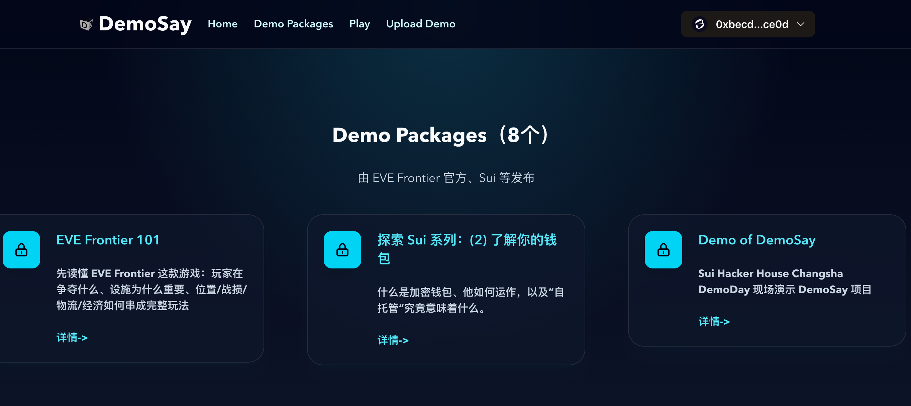
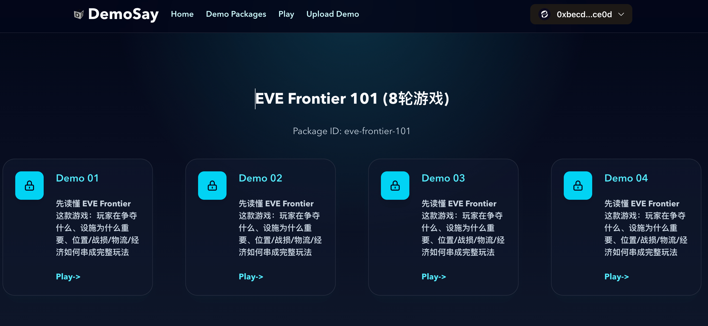
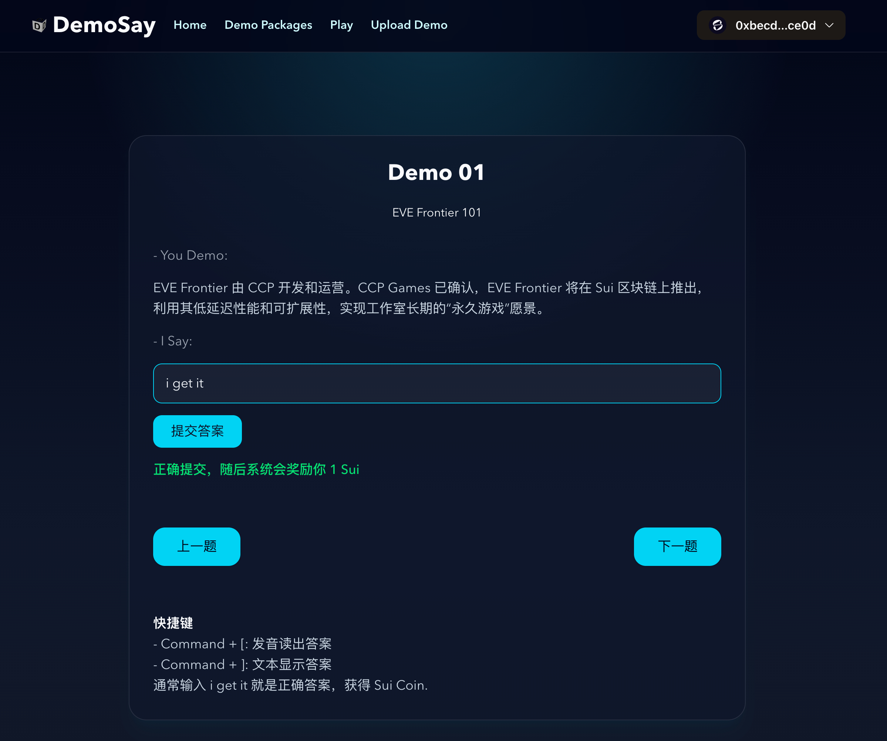

# DemoSay

DemoSay 是一个基于 Sui 链的游戏化的互动 Demo 平台。

## 项目概况

- 名称：DemoSay
- Slogan: You Demo. I Say.
- Website: www.demosay.com

## 游戏化的交互方式

在 DemoSay，发布者以文本、图片、表格、流程图、视频等形式发布 Demo，用于演示游戏玩法、产品的功能特点、解决方案、技术流程等，用户通过输入“i get it"表示有效观看了该 Demo，从而获得 Sui、EVE 等 token 作为奖励。

## 商业价值

DemoSay 有效促进了像 EVE Frontier 游戏、Sui 链社区等的传播、拉新和留存。

## 对 EVE Frontier 游戏的推广作用

作为 EVE Frontier 新手玩家，通过 "You Demo. I Say." 的独特的游戏化的方式查看官方(CCP)和游戏内 Builder 提供的各种 Demo 包，快速了解游戏内容和各种玩法，同时在 Sui 链获得记录学习成果的NFT。

官方或者 Builder 将相应 NFT 编程进智能合约 (Smart Assemblies)，给予新手玩家通行的便利、费用的优惠等，以此奖励玩家对游戏和智能合约(Smart Assemblies)的支持。

## 未来计划

- EVE Frontier 玩家通过 EVE Vault 登录后通过观看 EVE Frontier 提供的 Demo，可以获得 EVE Token(未来会由官方发行)。
- 开放接口，供 EVE Frontier Builder 建造智能合约 (Smart Assemblies)时使用。
- 增加 Terminal UI 交互方式。
- 通过 Slash Commands 接入 AI Agent，用户可深入了解 Demo 演示的场景和功能等。
- 增加移动端支持。

## 用户群体

新手玩家

## 技术栈

- Demo 包存储在 walrus
- Sui
- zkLogin

## 经济模型

- 方便游戏中的公会/联盟，根据需要去拉不同方向、不同层次的新手玩家。
- 官方吸引新玩家加入
- builder 推广智能合约、玩法，吸引新用户参与其建造的基础设施等

## DemoSay 的玩法

### 进入首页，点击菜单 Demo Packages

### 选择一个 Package

### 选择一个 Demo

### 开始 Play DemoSay

