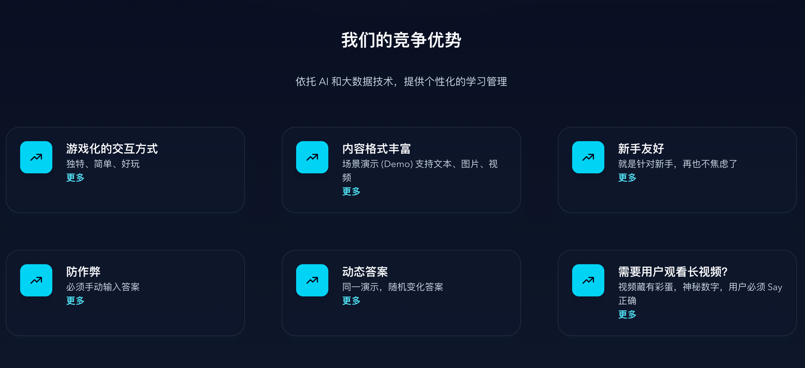

🇨🇳 [点击这里查看中文版本](README_CN.md)

# DemoSay

DemoSay is a gamified interactive Demo platform based on the **Sui Network**.

## Project Overview

- **Name:** DemoSay
- **Slogan:** You Demo. I Say.
- **Website:** [www.demosay.com](https://www.demosay.com)

## Gamified Interaction

On DemoSay, publishers release Demos in the form of text, images, tables, flowcharts, videos, etc., to demonstrate gameplay, product features, solutions, and technical processes. Users signal that they have effectively viewed the Demo by typing **"i get it"**, thereby earning tokens such as **Sui** and **EVE** as rewards.

## Commercial Value

DemoSay effectively promotes the dissemination, user acquisition, and retention of communities like **EVE Frontier** and the **Sui** ecosystem.

## Promotion for EVE Frontier

As a new player in EVE Frontier, you can quickly understand the game content and various mechanics by viewing the official (CCP) and in-game Builder-provided Demo packages through the unique gamified method of "You Demo. I Say." Simultaneously, you receive an NFT on the Sui chain recording your learning achievements.

The official team or Builders can code these NFTs into Smart Contracts (Smart Assemblies), offering new players conveniences such as access permissions or fee discounts, thereby rewarding players for supporting the game and Smart Contracts.

## Competitive Advantage

## Future Plans

- After logging in via **EVE Vault**, EVE Frontier players can earn **EVE Tokens** (to be issued officially in the future) by watching EVE Frontier-provided Demos.
- Open APIs for **EVE Frontier Builders** to use when building Smart Contracts (Smart Assemblies).
- Add **Terminal UI** interaction methods.
- Integrate **AI Agents** via Slash Commands, allowing users to gain a deeper understanding of the scenarios and functions demonstrated in the Demos.
- Add support for **Mobile** devices.

## Target Audience

New players.

#### Tech Stack

- **Demo Storage:** Walrus
- **Blockchain:** Sui
- **Authentication:** zkLogin

## Economic Model

- Facilitates in-game guilds/alliances to attract new players of different levels and directions based on their specific needs.
- Helps the official team attract new players.
- Assists builders in promoting Smart Contracts and gameplay to attract new users to participate in their infrastructure.

## How to Play DemoSay

*(Image: DemoSay Interface Flow)*

1. **Select a Package**
2. **Select a Demo**
3. **Start Playing DemoSay**

### Visit Home Page

### Select a Package

### Select a Demo

### Start Playing DemoSay

